# GUI使用说明

#### 1.文件结构

`GUI/src`路径下为源代码，`GUI/bin`路径下为打包生成的dmg文件。编写、测试环境为`macOS Mojave`，平台为`Qt5.12.0`

#### 2.功能介绍

主界面如下：

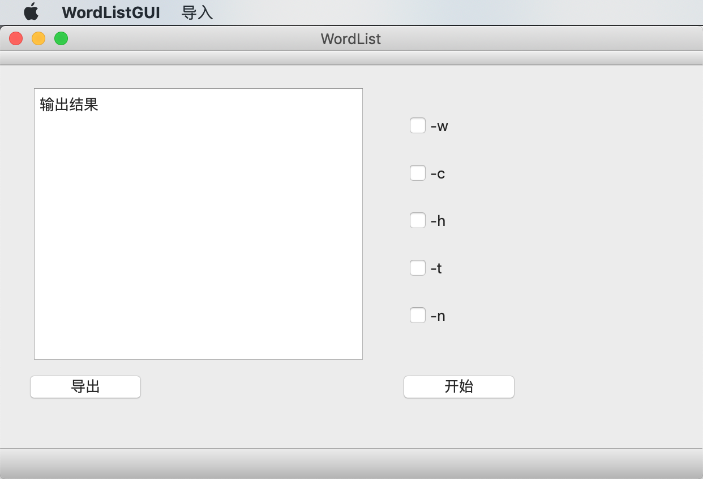

##### (1)导入

点击菜单栏`导入`后选择`来自文件`或`手动输入`

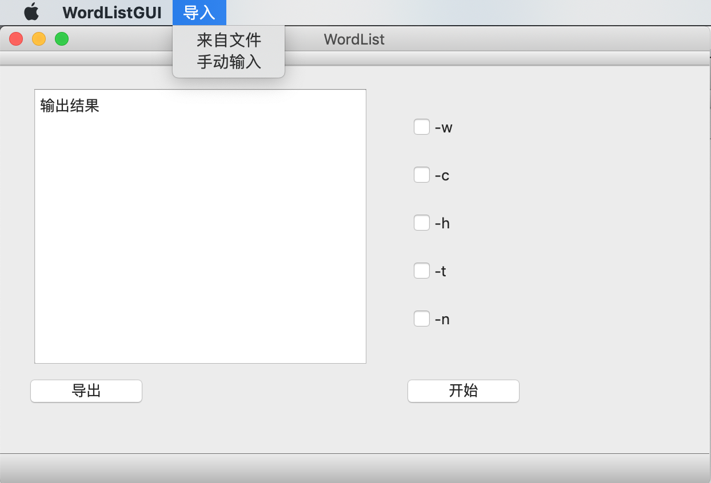

从文件导入：

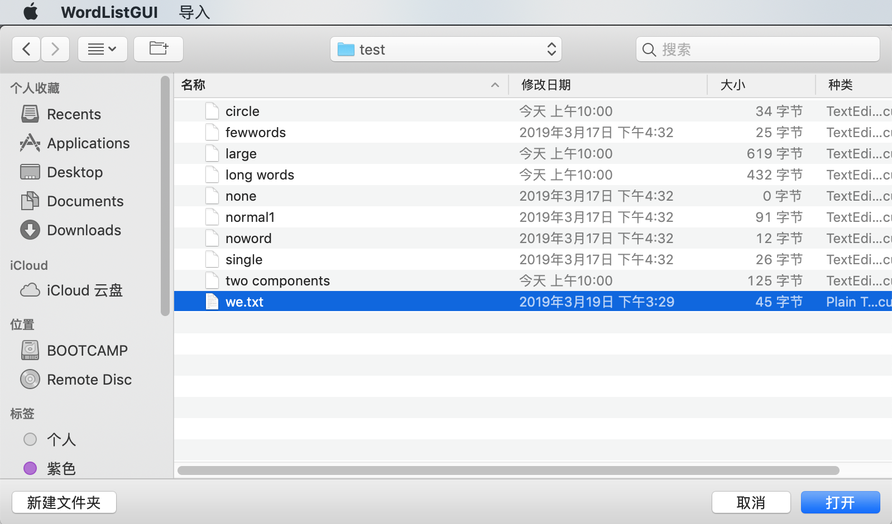

若正常导入

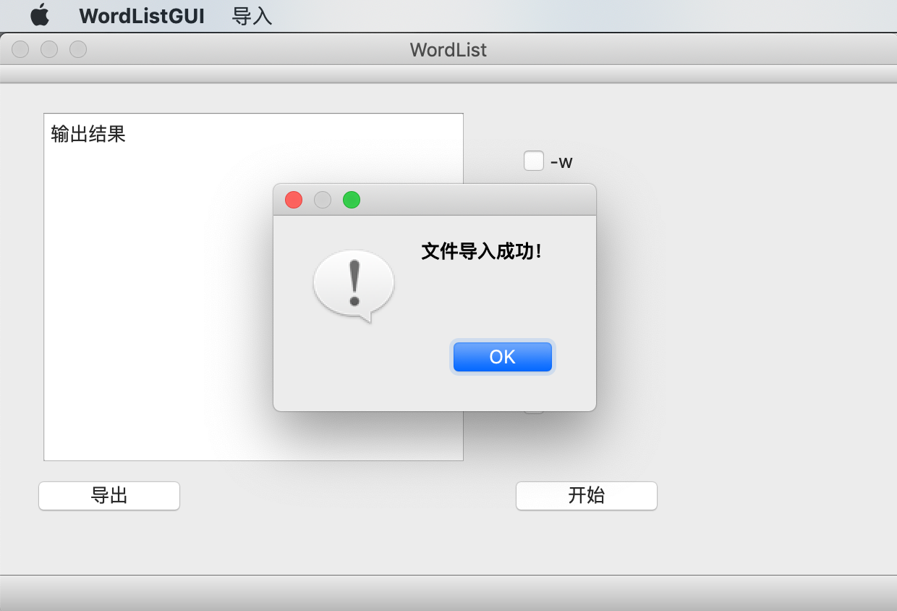

若文件中没有单词

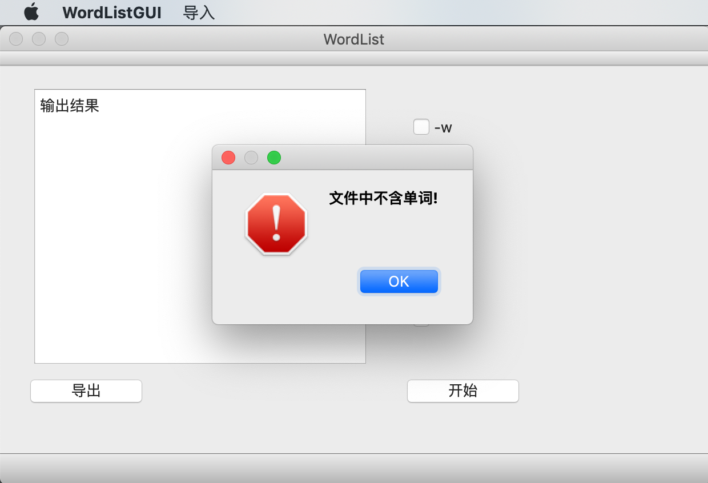

手动输入

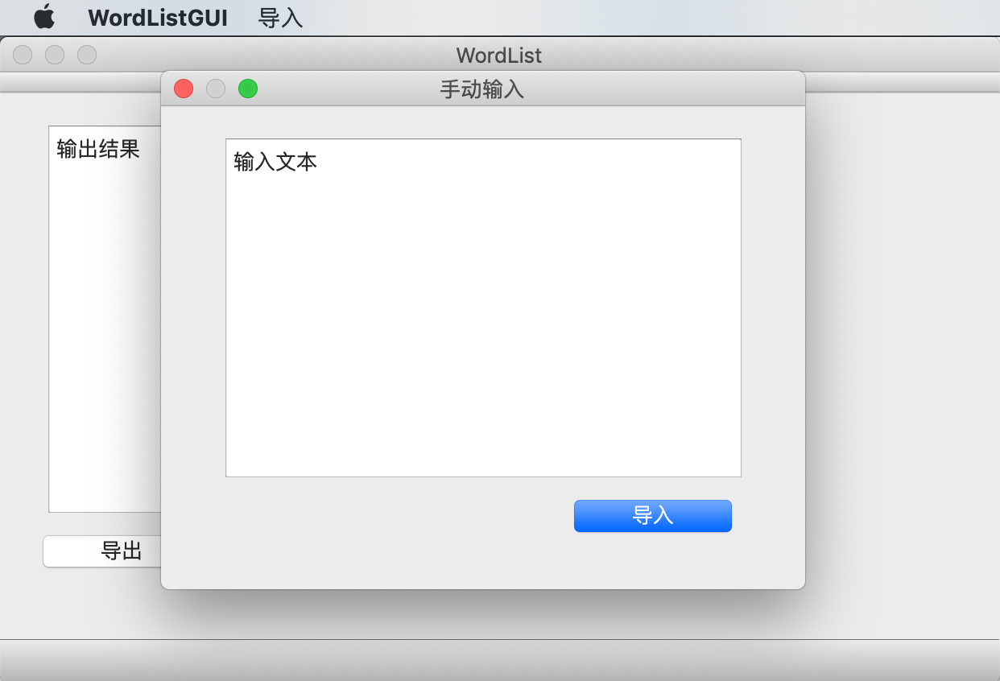

若手动输入成功

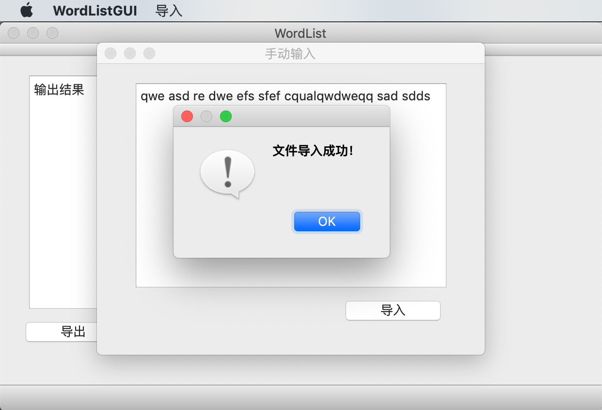

若输入不含单词

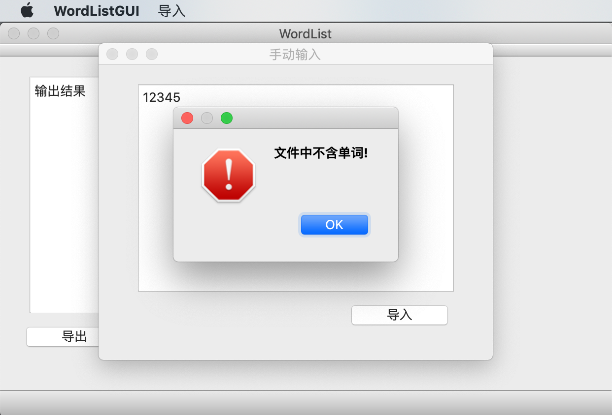

不允许重复导入

##### (2)按钮选项

已用`QButtonGroup`的`setExclusive()`函数设置`-w`和`-c`按钮不可同时选中

`-h`、`-t`、`-n`按钮在不被选中时隐藏后面的输入参数框

点击`开始`按钮后将输出结果，参数正常时结果如下：

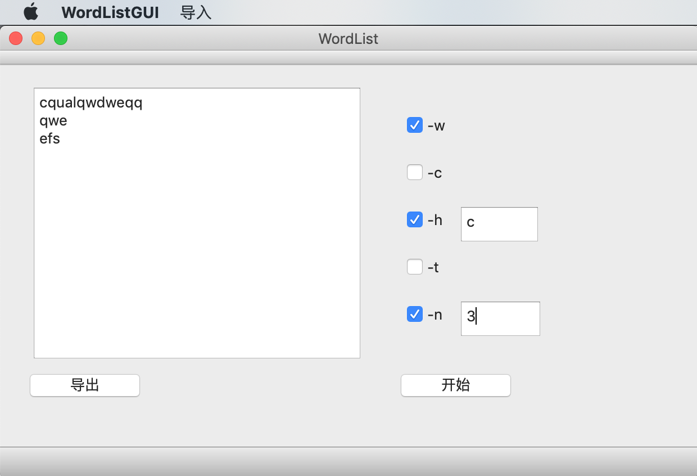

若在点击`开始`按钮前未导入或导入出错

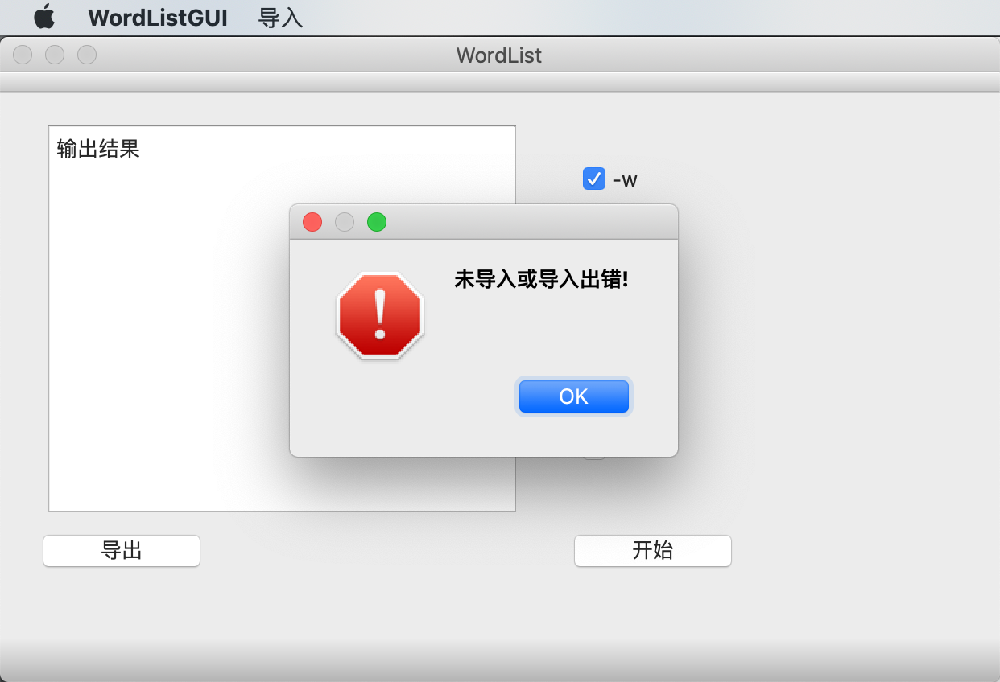

若未选择`-w`或`-c`

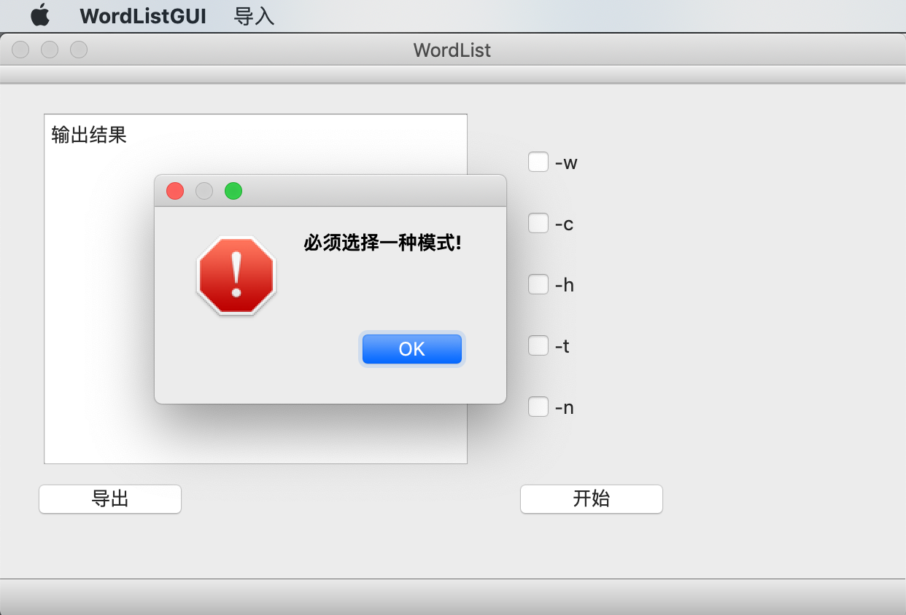

若`-h`后参数不为字母(`-t`类似，不再截图）

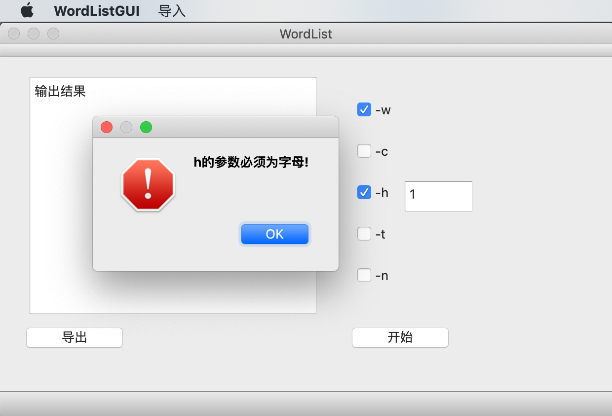

若`-n`后的参数不为正数

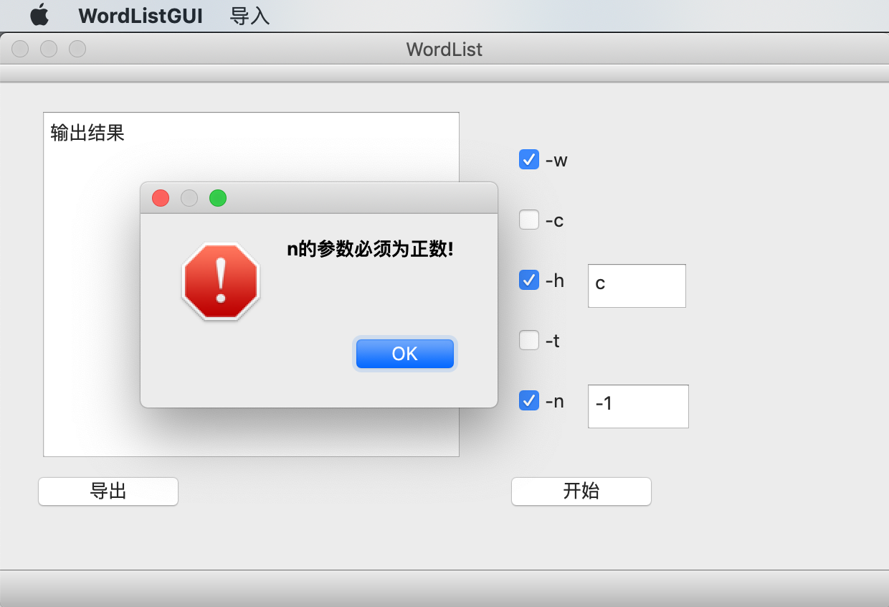

##### (3)导出结果

点击主界面`导出`按钮后选择存储位置并输入文件名

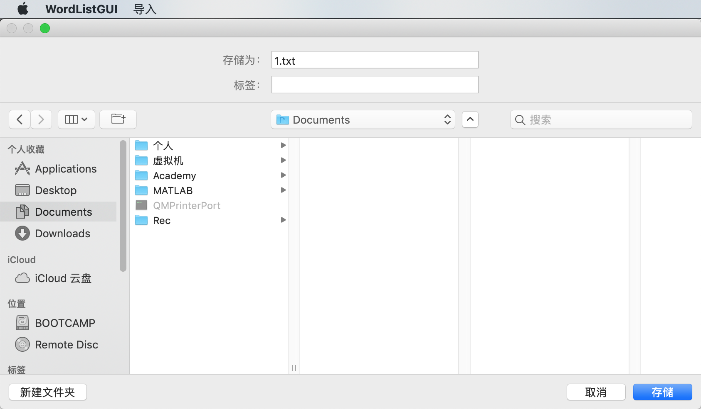

点击`存储`后若成功导出

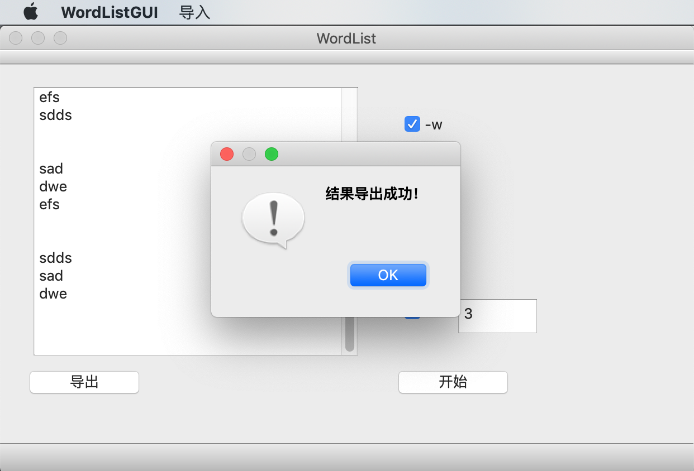