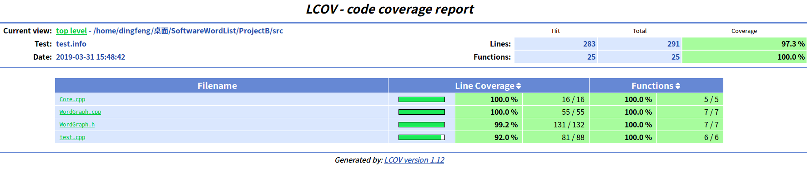

# 计算最长英语单词链(二)

——把计算单词链的功能封装为独立模块,并设计单元测试
## 如何运行请详见[README.md](../README.md)
## Core类 API接口介绍

```C++
    /* vector<string> Core::gen_chain_word(vector<string> words, char head, char tail);
    * 这个函数接受三个参数, words 为输入的单词列表, head 为所要求的单词链的头字母, 
    * tail 万所要求的单词链尾字母,函数返回值为所要求的最长单词个数的单词链 vector<string>
    */
    vector<string> Core::gen_chain_word(vector<string> words, char head, char tail);

    /* vector<string> Core::gen_chain_char(vector<string> words, char head, char tail);
    * 这个函数接受三个参数, words 为输入的单词列表, head 为所要求的单词链的头字母, 
    * tail 万所要求的单词链尾字母,函数返回值为所要求的最多字母个数的单词链 vector<string>
    */
    vector<string> Core::gen_chain_char(vector<string> words, char head, char tail);

    /* vector<vector<string>> Core::gen_chain_word(vector<string> words, int num, char head, char tail);
    * 这个函数接受三个参数, words 为输入的单词列表, head 为所要求的单词链的头字母, 
    * tail 万所要求的单词链尾字母,函数返回值为所要求的单词链 num 为所要求的字母链的个数
    */
    vector<vector<string>> Core::gen_chain_word(vector<string> words, int num, char head, char tail);

    /* 若对首尾字母不做要求，则置head, tail 为 \0, 若对单词链长度不做要求，则置num为-1
     *
```

## 单元测试代码

### 测试数据

测试数据为`test/`里的文件。

```c++
// 读入测试文件的数据
if(argc > 1) {
        for(int i=1;i<argc;i++) {
            input = openfile(argv[i]);
            wordsVec.push_back(input);
        }
}
else {
    cerr<<"please follow a test file name."<<endl;
    exit(1);
}
// 指定了首尾字母，使得测试覆盖面更广
char head[]= {'\0','\0','\0','s','a'};
char tail[]= {'\0','\0','e', '\0','g'};
```

`wordsVec`中包含一组只有一个字符串的数据和四组长度为8的字符串链，与`head`和`tail`中五组数据对应，对每个API进行五种测试，分别为输入单词列表为空、不指定`-h -t`、指定`-h`、指定`-t`、指定`-h -t`

### 测试API 1

```c++
//test for vector<string> Core::gen_chain_word(vector<string> words, char head, char tail);
	cout << "test for API 1" << endl;
    for (int i=0; i<argc-1; i++)
    {
        cout << "case " << i+1 << ": "<<endl;
        retWord[i] = Core::gen_chain_word(wordsVec[i], head[i], tail[i]);
        cout<<"head "<<head[i]<<" tail "<<tail[i]<<" test file: "<<argv[i+1]<<endl;
        if(checkIsChain(retWord[i]))
            cout<<"Test "<<i+1<<" Success"<<endl;
        else {
            cout<<"Test "<<i+1<<" Fail!"<<endl;
            for(auto j:retWord[i])
                cout<<j<<" ";
        }
        
    }
```


测试结果如下：


结果正确

### 测试API 2

```c++
//test for vector<string> Core::gen_chain_char(vector<string> words, char head, char tail);
	cout << "test for API 2" << endl;
    for (int i=0; i<argc-1; i++)
    {
        cout << "case " << i+1 << ": "<<endl;
        retChar[i] = Core::gen_chain_char(wordsVec[i], head[i], tail[i]);
        cout<<"head "<<head[i]<<" tail "<<tail[i]<<" test file: "<<argv[i+1]<<endl;
        if(checkIsChain(retWord[i]))
            cout<<"Test "<<i+1<<" Success"<<endl;
        else {
            cout<<"Test "<<i+1<<" Fail!"<<endl;
        }
    }
    cout <<"***************"<< endl;
```


测试结果如下：


### 测试API 3

```c++
//test for vector<vector<string>> Core::gen_chain_word(vector<string> words, int num, char head, char tail);
vector<vector<string>> retList[5];

	cout << "test for API 3" << endl;
    for (int i=0; i<argc-1; i++)
    {
        cout << "case " << i << ": ";
        int num = rand() % 5 +2;
        cout<<"head "<<head[i]<<" tail "<<tail[i]<<" Wordchain size "<<num<<
            " test file: "<<argv[i+1]<<endl;
        retList[i] = Core::gen_chain_word(wordsVec[i], num, head[i], tail[i]);
        cout << "number of word chains " << ":" << retList[i].size() << endl;
        
        bool flag = true;
        for (auto vec : retList[i])
        {
            if(checkIsChain(vec))
                continue;
            else {
                cout<<"Test Fail"<<endl;
                flag = false;
            }
        }
        if(flag) cout<<"Test Success"<<endl;
        cout <<"***************"<< endl;
    }
```


测试结果如下：


结果正确

### 检验测试合法性

```C++
bool checkIsChain(vector<string> wordchain)
{
    if(wordchain.size()< 2) {
        cout<<"Word chain does not exist. "<<endl;
        return true;
    }
    
    char head, tail;
    for(int i=0;i<wordchain.size()-1;) {
        tail = wordchain[i].back();
        i++;
        head = wordchain[i].front();
        if(head != tail) 
            return false;
    }
    return true;
}
```

### 测试覆盖率

总体覆盖率（随测试文件不同，覆盖率有所变化）如下：




### 运行结果

