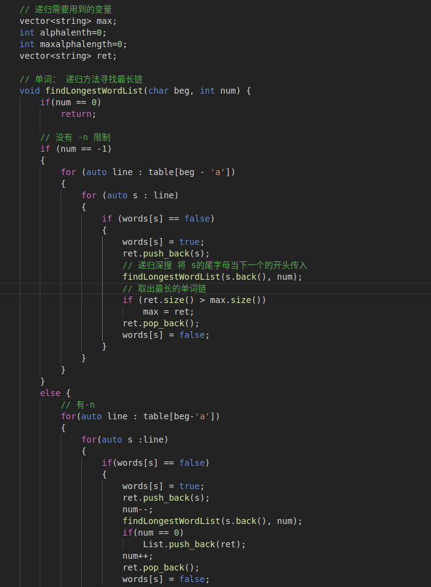
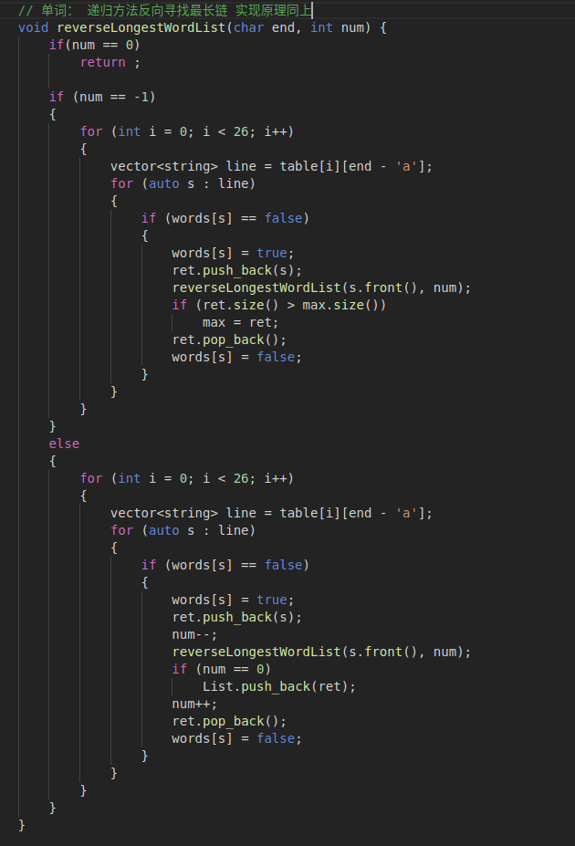
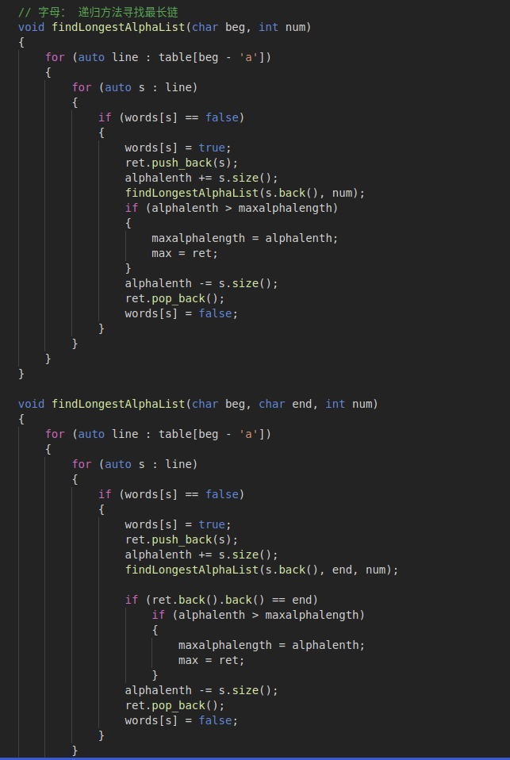

# 软件工程实验报告——最长单词链——lab1-C

小组成员：丁峰、谢灵江、连家诚

## 功能实现

软件输出的单词链会保存在`bin/answer.txt`中。

我们的软件可以实现在给定单词链长度下的所有单词链输出查询（即`-n -w `下），在此基础上，也可以进一步限定开头首尾字母，但不能对`-n -c`的情况进行处理。对于特殊的情况:

 - 若`-n`所要求的单词链长度大于最长的单词链长度，那么程序会输出错误信息进行提示：`Error: None word list satisfies your need.`
 - 若没有单词链存在（有两个及以上的单词组成的称之为单词链），程序会返回错误信息：`Error: Too few words in the file. And none word list exists.`
 - 若用户输入了一个不存在的文件，程序会进行报错：`The file xxxx cannot be found`
 - 若用户输入了一个不存在的选项，例如 `-x` ,程序也会进行报错
 - 用户交互时，一定要在所给的输入文件前指定选项`-n`还是`-w`，否则会报错：`Error: No main instruction`
 - 由于寻找最长单词链的算法复杂度较高，因此对于上百单词数量的文件，程序运行时间会比较长。

## Core类 API接口

```C++
    /* vector<string> Core::gen_chain_word(vector<string> words, char head, char tail);
    * 这个函数接受三个参数, words 为输入的单词列表, head 为所要求的单词链的头字母, 
    * tail 万所要求的单词链尾字母,函数返回值为所要求的最长单词个数的单词链 vector<string>
    */
    vector<string> Core::gen_chain_word(vector<string> words, char head, char tail);

    /* vector<string> Core::gen_chain_char(vector<string> words, char head, char tail);
    * 这个函数接受三个参数, words 为输入的单词列表, head 为所要求的单词链的头字母, 
    * tail 万所要求的单词链尾字母,函数返回值为所要求的最多字母个数的单词链 vector<string>
    */
    vector<string> Core::gen_chain_char(vector<string> words, char head, char tail);

    /* vector<vector<string>> Core::gen_chain_word(vector<string> words, int num, char head, char tail);
    * 这个函数接受三个参数, words 为输入的单词列表, head 为所要求的单词链的头字母, 
    * tail 万所要求的单词链尾字母,函数返回值为所要求的单词链 num 为所要求的字母链的个数
    */
    vector<vector<string>> Core::gen_chain_word(vector<string> words, int num, char head, char tail);

    /* 若对首尾字母不做要求，则置head, tail 为 \0, 若对单词链长度不做要求，则置num为-1
     */


    // Project C
    /* 输入处理文本API 将文件名输入，然后返回处理后的不含任何重复单词的单词集合
     */
    vector<string> text_preprocess(string path);
```


## 测试用例设计思想

测试用例一共11个，其中test5与test7分别测试了当文件为空时与文件中并不包含任何单词时的情况，test2测试了文件中仅有不成链的单字组成的单词（a，I）的情况，test8测试了整个文件中仅有一个单词的情况，是基础的特殊情况测试;

test4存在4个单词形成的链以及1个比该链字母数更多的单词，此测试样例是为了测试在-c模式下是否能够区分并找到单词链（即个数大于等于2），而并非输出单个长单词。

test9测试了当文件中的单词组成两个连通片，且“最多单词的单词链”与“最长单词的单词链”并非同一个单词链的情况，事实上本程序能够正确的按指令搜索并且输出。

test1由6个单词组成的环构成，用于简单测试-n的正确性。在参数值位于2-6之间时，-n都输出正确的6个结果，证明测试过关。

test11由随机生成的60个单词组成，用于测试性能，在一台性能较差的笔记本电脑使用该文件的测试中，-c与-w的命令仍能在数秒之内计算出答案。

test3由随机生成的100个单词组成，用于最终测试。使用-c与-w指令运行该文件已完全不能在可接受的时间内计算出结果，而使用-n指令时，当参数值<=7时耗时在1s以内;参数值为8时能计算出所有结果（440000+），但输出耗时过高。

test6与test10是普通的测试样例。


## 基本算法

​	采用了**回溯算法**实现。具体地来说，我们把所有单词的关系抽象成了一张图，单词就是这张图的边，它的首尾字母便是图的点，那么单词链就是首尾相连的边组成的路径，权重可以是1，或者是单词的字母数量，于是我们就把问题转化为了求一张图的最长路径。

​	采用的回溯算法就是从一个单词的首字母开始，进行递归深搜，递归函数完成后再返回状态，还要用一个全局变量记录下最长的单词链。对于不同的需求（单词链长度、字母长），可以加上不同的限制。若未规定头尾字母，那么就遍历图中所有的字母，取最长的单词链。若仅规定了尾字母，那么就将整个边倒置过来进行深搜即可。

## 实现原理及代码框架

[CommandLineParse.cpp](../src/CommandLineParse.cpp)主要功能是对用户输入的命令行进行解析，处理一些异常错误等，并调度`WordGraph`类完成核心算法，最后完成结果的输出。

[WordGraph.cpp](../src/WordGraph.cpp)和[WordGraph.h](../src/WordGraph.h)是描述了一个有向连通图，`WordGraph`类内有所有的单词以及它们的开头字母集合和结尾字母集合，用于支持核心算法的操作，还作为核心算法的函数载体，完成调用工作。

## 关键代码截图



<center>图1：单词最长链核心算法</center>



<center>图2：反向寻找单词最长链</center>



<center>图3：寻找最长字母链的核心代码</center>
