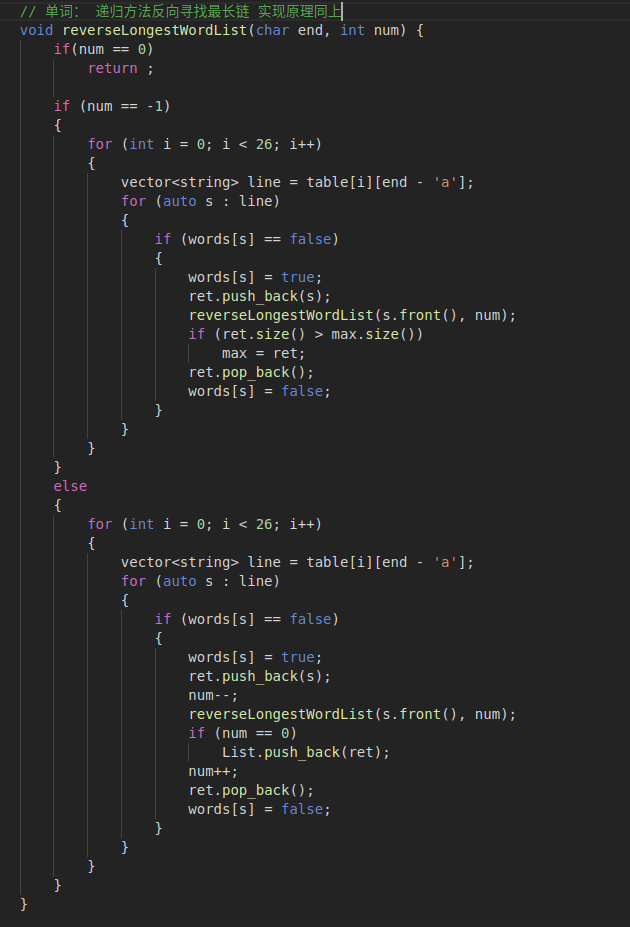

# 软件工程实验报告——单词链

小组成员：丁峰、谢灵江、连家诚

## 基本算法

​	采用了**回溯算法**实现。具体地来说，我们把所有单词的关系抽象成了一张图，单词就是这张图的边，它的首尾字母便是图的点，那么单词链就是首尾相连的边组成的路径，权重可以是1，或者是单词的字母数量，于是我们就把问题转化为了求一张图的最长路径。

​	采用的回溯算法就是从一个单词的首字母开始，进行递归深搜，递归函数完成后再返回状态，还要用一个全局变量记录下最长的单词链。对于不同的需求（单词链长度、字母长），可以加上不同的限制。若未规定头尾字母，那么就遍历图中所有的字母，取最长的单词链。若仅规定了尾字母，那么就将整个边倒置过来进行深搜即可。

## 实现原理及代码框架

[CommandLineParse.cpp](../src/CommandLineParse.cpp)主要功能是对用户输入的命令行进行解析，处理一些异常错误等，并调度`WordGraph`类完成核心算法，最后完成结果的输出。

[WordGraph.cpp](../src/WordGraph.cpp)和[WordGraph.h](../src/WordGraph.h)是描述了一个有向连通图，`WordGraph`类内有所有的单词以及它们的开头字母集合和结尾字母集合，用于支持核心算法的操作，还作为核心算法的函数载体，完成调用工作。

## 关键代码截图

图1：单词最长链核心算法

图2：反向寻找单词最长链

图3：寻找最长字母链的核心代码

## 测试用例设计思想

