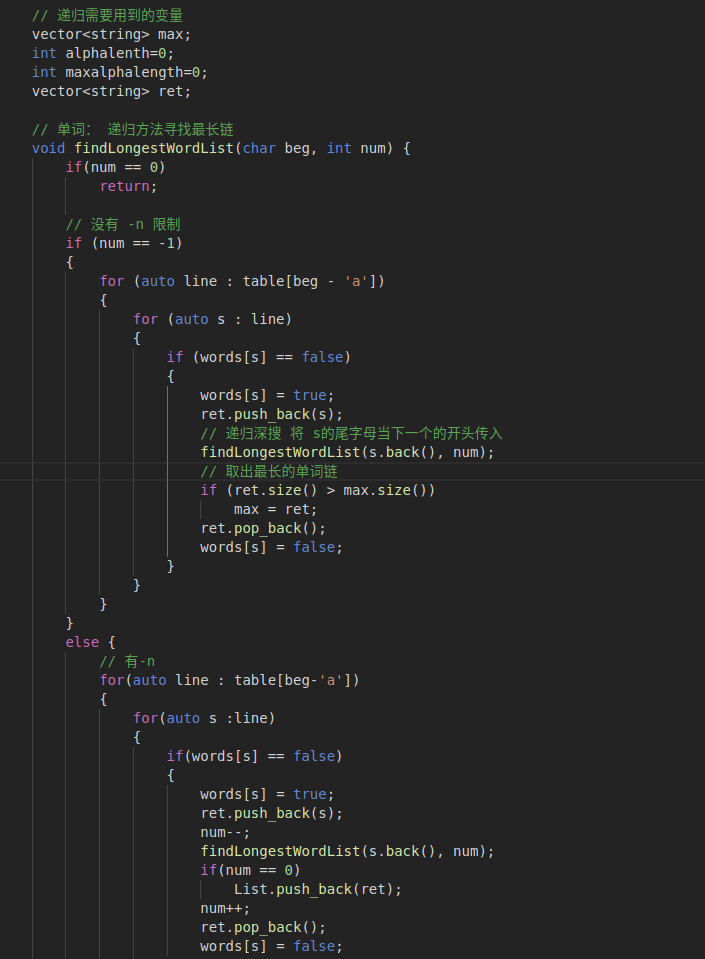
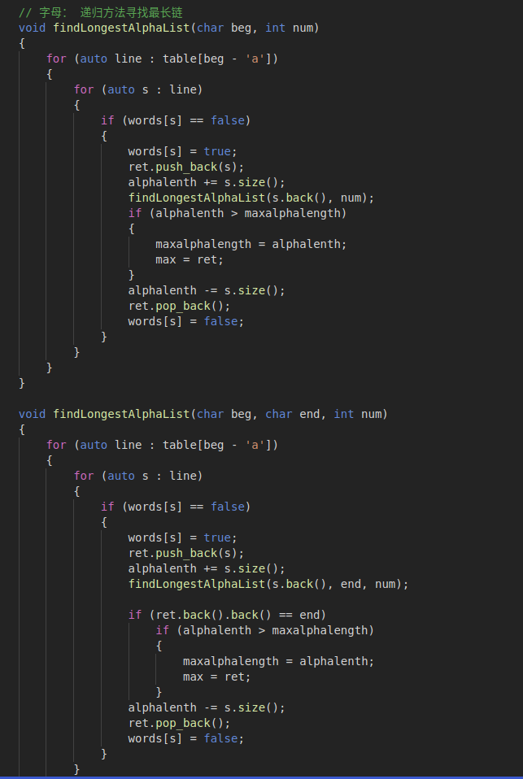

# 软件工程实验报告——单词链

小组成员：丁峰、谢灵江、连家诚

## 基本算法

​	采用了**回溯算法**实现。具体地来说，我们把所有单词的关系抽象成了一张图，单词就是这张图的边，它的首尾字母便是图的点，那么单词链就是首尾相连的边组成的路径，权重可以是1，或者是单词的字母数量，于是我们就把问题转化为了求一张图的最长路径。

​	采用的回溯算法就是从一个单词的首字母开始，进行递归深搜，递归函数完成后再返回状态，还要用一个全局变量记录下最长的单词链。对于不同的需求（单词链长度、字母长），可以加上不同的限制。若未规定头尾字母，那么就遍历图中所有的字母，取最长的单词链。若仅规定了尾字母，那么就将整个边倒置过来进行深搜即可。

## 实现原理及代码框架

[CommandLineParse.cpp](../src/CommandLineParse.cpp)主要功能是对用户输入的命令行进行解析，处理一些异常错误等，并调度`WordGraph`类完成核心算法，最后完成结果的输出。

[WordGraph.cpp](../src/WordGraph.cpp)和[WordGraph.h](../src/WordGraph.h)是描述了一个有向连通图，`WordGraph`类内有所有的单词以及它们的开头字母集合和结尾字母集合，用于支持核心算法的操作，还作为核心算法的函数载体，完成调用工作。

## 关键代码截图

图1：单词最长链核心算法

图2：反向寻找单词最长链

图3：寻找最长字母链的核心代码

## 测试用例设计思想

测试用例一共11个，其中test5与test7分别测试了当文件为空时与文件中并不包含任何单词时的情况，test2测试了文件中仅有不成链的单字组成的单词（a，I）的情况，test8测试了整个文件中仅有一个单词的情况，是基础的特殊情况测试;

test4存在4个单词形成的链以及1个比该链字母数更多的单词，此测试样例是为了测试在-c模式下是否能够区分并找到单词链（即个数大于等于2），而并非输出单个长单词。

test9测试了当文件中的单词组成两个连通片，且“最多单词的单词链”与“最长单词的单词链”并非同一个单词链的情况，事实上本程序能够正确的按指令搜索并且输出。

test1由6个单词组成的环构成，用于简单测试-n的正确性。在参数值位于2-6之间时，-n都输出正确的6个结果，证明测试过关。

test11由随机生成的60个单词组成，用于测试性能，在一台性能较差的笔记本电脑使用该文件的测试中，-c与-w的命令仍能在数秒之内计算出答案。

test3由随机生成的100个单词组成，用于最终测试。使用-c与-w指令运行该文件已完全不能在可接受的时间内计算出结果，而使用-n指令时，当参数值<=7时耗时在1s以内;参数值为8时能计算出所有结果（440000+），但输出耗时过高。

test6与test10是普通的测试样例。